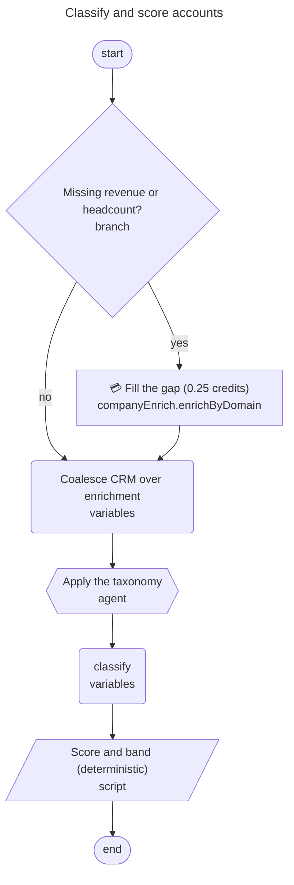

# Diagramming a node graph (Mermaid)

A workflow the user can't see is a workflow they can't approve. A node graph is a
directed graph with routing, fallbacks, and paid steps in it — prose flattens all
three. Render it as a Mermaid `flowchart` instead: it costs nothing, and it renders
in Claude Code, on GitHub, and in the Cargo docs.

`cargo-ai orchestration node diagram` does it (**CLI ≥ 1.0.54**; `unknown command`
means the pin hasn't moved yet — bump per [`../../cargo/SKILL.md`](../../cargo/SKILL.md)
§ "At session start"). Free, runs nothing, no credits — same family as
`node validate`.

## When to draw one

- **At the plan gate**, before `draft-release deploy` / `cdk deploy` — the diagram
  *is* the "nodes and data flow" half of the plan ([`../../cargo/references/interaction.md`](../../cargo/references/interaction.md) §1).
- **When explaining an existing workflow, tool, or play** — "what does this play
  do?" is one command against its `workflowUuid`.
- **When reporting a trace** — the graph with the failing node marked red, next to
  the error ([`../../cargo-diagnostics/references/run-trace.md`](../../cargo-diagnostics/references/run-trace.md)).

Skip it for a linear graph of three nodes or fewer, or a one-node change — say what
changed in a sentence instead. A diagram of `start → enrich → end` is ceremony.

## Generate it

```bash
# An existing workflow, tool, or play (workflowUuid from `tool list` / `play list`)
cargo-ai orchestration node diagram --workflow-uuid <uuid> --raw

# The draft you are about to deploy — the plan-gate case
cargo-ai orchestration node diagram --workflow-uuid <uuid> --draft --raw

# A graph you are authoring, before it exists server-side
cargo-ai orchestration node diagram --nodes '[...]' --raw

# The graph a run executed, with the failing node marked
cargo-ai orchestration node diagram --run-uuid <uuid> --highlight <node-slug> --raw
```

Pass exactly one source: `--nodes` (or `-` to read stdin), `--file <path>`,
`--workflow-uuid` (deployed, `--draft` for the draft), `--release-uuid`, or
`--run-uuid`.

| Flag | Effect |
| --- | --- |
| `--title <text>` | Title rendered above the diagram. |
| `--direction TD\|LR` | Flow direction (default `TD`; `LR` reads better for long linear graphs). |
| `--paid <slugs>` | Comma-separated node slugs/uuids that bill credits — marked 💳. |
| `--highlight <slugs>` | Comma-separated slugs/uuids to mark red — the failing node in a trace. |
| `--raw` | Print the fenced Mermaid block instead of JSON. |

Without `--raw` it returns `{"diagram": "...", "format": "mermaid", "warnings": [...]}`
like every other command. **Read the `warnings`** — they carry the structural
problems a tidy drawing would otherwise hide (nodes unreachable from `start`,
dangling `childrenUuids`) and belong in what you tell the user.

`--run-uuid` handles both run shapes: a run from `action execute` carries its own
`nodes`, a run of a deployed tool or play carries only a `releaseUuid`, and the
command follows whichever it has.

## What maps to what

You rarely need this table — the command emits it — but it is what to check when
reading a diagram someone else produced, or hand-writing one for a graph that
isn't in Cargo yet.

| Node | Mermaid | Rendered as |
| --- | --- | --- |
| `start` / `end` | `n0(["start"])` | stadium |
| `branch`, `filter`, `switch`, `split` | `n1{"Enterprise?"}` | diamond |
| `connector` | `n2["Enrich Company<br/>companyEnrich.enrichByDomain"]` | rectangle |
| `tool` | `n3[["tool e487d28e"]]` | subroutine box |
| `agent` (node kind or native action) | `n4{{"Apply the taxonomy"}}` | hexagon |
| `python`, `script` | `n5[/"Score and band"/]` | parallelogram |
| `variables`, `delay`, other native | `n6("Coalesce CRM over enrichment")` | rounded |
| `group` | rectangle + `subgraph` holding its `_nodes` | box-in-box |

Edges come from `childrenUuids`, in order, labelled by what the routing node means:

| Node | Edge labels |
| --- | --- |
| `branch` | `yes` (index 0, condition matched), `no` (index 1) |
| `filter` | `if true` — a false filter ends the run, so there is no second edge |
| `switch` | the `routes[i].name` matching each child index |
| `split` | `A <pct>%` / `B <100-pct>%` |
| `fallbackChildUuid` → a *different* node | a **dashed** `-. on failure .->` edge — the waterfall pattern |
| `fallbackChildUuid` → the node's own next step | a `↷` on the label, not a second arrow: a failure here doesn't stop the run |

## Rules that make the diagram true

Why to run the command rather than transcribe a graph by hand. Each of these was
hit against a live workspace, not imagined:

- **Nodes are keyed by `uuid`, never by `slug`.** Slugs repeat within a single
  release — a shipped waterfall has **six** nodes slugged `variables`, and a play
  has an `agent` node and a `variables` node both slugged `classify`. A slug-keyed
  diagram silently collapses them into one node and reroutes every edge that
  touched them. (Same trap downstream: `{{nodes.<slug>...}}` and
  `runContext.<slug>` are ambiguous for a repeated slug, so give any node you
  reference later a distinct slug.)
- **`childrenUuids` order carries meaning.** Index 0 of a `branch` is the matched
  path. Swapping the labels inverts what the workflow appears to do.
- **Fallback edges are the mechanism, not decoration.** In waterfall graphs each
  provider falls through to the next on failure; a diagram without those edges
  shows a chain of unrelated enrichments.
- **A `null` in `childrenUuids`, or a node unreachable from `start`, is a finding.**
  It arrives in `warnings`. Say it out loud rather than drawing a tidy graph over a
  broken one — an orphaned node never runs.
- **`tool` and `agent` nodes are drawn from `toolUuid` / `agentUuid`** (top-level
  node fields; these nodes have no `actionSlug`), so the box reads `tool e487d28e`.
  Resolve the real name with `orchestration tool get` / `ai agent get` when it
  matters to the reader.
- **Mark the paid nodes.** Which action bills is not in the release — check the
  provider playbook (`../../cargo-gtm/provider-playbooks/<slug>.md`) or
  `connection integration list`, then pass those slugs to `--paid`. This is the
  plan gate's "cost shape" made visible; the per-record estimate still goes in the
  text ([`../../cargo-gtm/references/cost-discipline.md`](../../cargo-gtm/references/cost-discipline.md)).

## Worked example

```bash
cargo-ai orchestration node diagram --workflow-uuid b338e04b-… --draft \
  --title "Classify and score accounts" --paid enrich --raw
```



Read out loud: enrichment only fires for records missing revenue or headcount (so
the credit line scales with the gap, not the segment), the model classifies, and
the score is deterministic afterwards. That sentence is what the user approves —
the diagram is what makes it checkable.

## If the surface can't render Mermaid

Some terminals and chat surfaces show the fenced block as text. Keep the fence (it
stays copy-pasteable into GitHub or the docs) and add a one-line path summary
beneath it — `start → branch(missing firmographics) → enrich 💳 → merge → agent →
score → end`. Don't replace the diagram with an ASCII drawing; it wastes context
and reads worse than the sentence.
